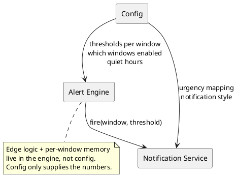

# Alert Configuration

How a user controls **when and how** Claude Meter warns them. This is the conceptual guide; the exact file format is in [[Configuration-Reference]].

## What you can configure

1. **Thresholds** — the percentages that trigger a warning. Default: `70, 80, 90, 100`.
2. **Per-window / per-model / per-group thresholds** — different thresholds for `5h`, `weekly`, or any model-scoped window such as `weekly:opus` / `weekly:sonnet`. Resolved most-specific-first (window → group → global). See [[Usage-Limits-and-Windows]].
3. **Which windows to watch** — `auto` (track every window the API returns, including per-model) or a manual list; optionally hide windows that aren't active yet.
4. **Polling interval** — how often usage is checked.
5. **Urgency mapping** — which threshold maps to normal/high/critical (see [[Notifications-and-Alerts]]).
6. **Quiet hours / Do Not Disturb** — windows of time to suppress popups.
7. **Pause durations** — the preset durations offered in the [[System-Tray|tray]] "Pause alerts" menu.

## Mental model



## Examples (intent, not final syntax)

**Default — warn at the four standard levels on both windows:**
```toml
thresholds = [70, 80, 90, 100]
windows    = ["5h", "weekly"]
```

**Earlier warnings on the short window, standard on weekly:**
```toml
[thresholds.per_window]
"5h"     = [60, 75, 90, 100]
"weekly" = [70, 90, 100]
```

**Quieter: only warn me late, and never overnight:**
```toml
thresholds = [90, 100]
quiet_hours = { from = "23:00", to = "07:00" }
```

See [[Configuration-Reference]] for every key, type, and default.

## Where settings live

- Stored via **KConfig** (see [[Technology-Stack]]), typically at `~/.config/claude-meter/claude-meterrc` (path TBD).
- Editable by hand now; an optional **Settings UI** (see [[Components]]) comes later.
- Secrets (account tokens) are **not** stored here — see [[Usage-Data-Provider#Authentication considerations]].

## Validation rules

- Thresholds must be `1–100`, sorted ascending on load (deduplicated).
- At least one window must be enabled.
- `pollIntervalSeconds` has a sane minimum to avoid hammering the source (see [[Configuration-Reference]]).
- Invalid config falls back to defaults with a warning notification.
