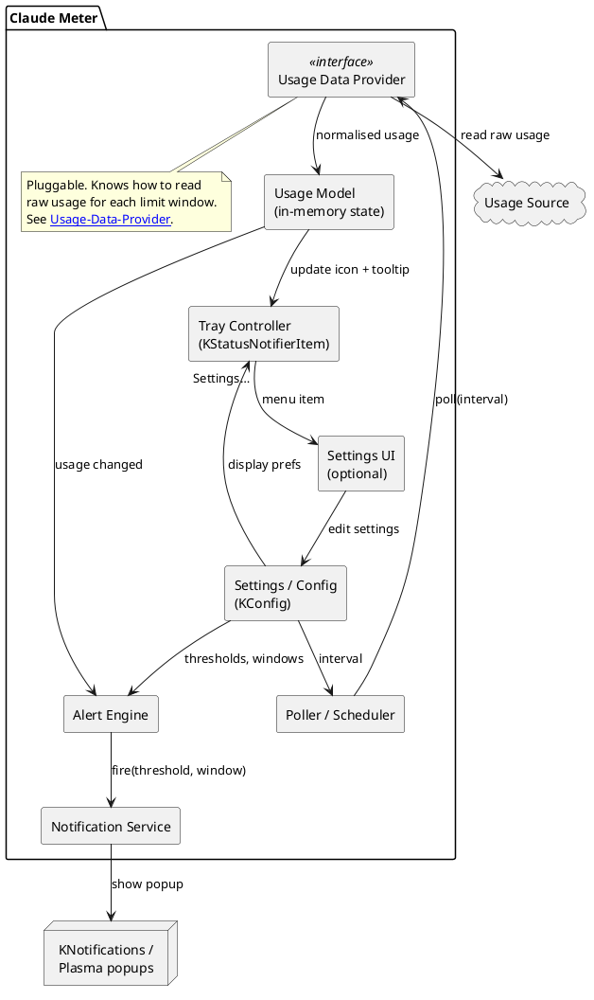
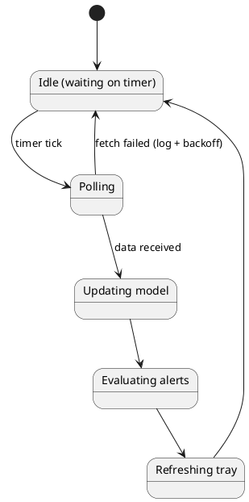

# Architecture

This note describes the overall structure of [[Overview|Claude Meter]]. The design favours a small number of clearly-separated components so the **source of usage data** can change later without touching the rest of the app.

## Architectural principles

1. **Single responsibility components.** Polling, modelling, alerting, and presentation are separate.
2. **Pluggable data source.** The [[Usage-Data-Provider]] sits behind an interface so it can be swapped (e.g. local-file reader vs. HTTP API) — see [[Open-Questions]].
3. **State-driven UI.** The tray icon and notifications are derived from a single in-memory [[Data-Model|Usage Model]]; there is one source of truth.
4. **Stateless alerts, persisted edges.** The Alert Engine only fires on a *newly crossed* threshold, so we persist which thresholds were already notified per window (see [[Notifications-and-Alerts]]).
5. **Config first.** Behaviour is data-driven from [[Configuration-Reference|config]]; sane defaults ship out of the box.

## Component diagram

## Runtime shape

Claude Meter is a single long-running process started at login (autostart `.desktop` entry). Internally it is event-driven on the Qt event loop:

- A **timer** drives the Poller at the configured interval.
- Polling and any network/file I/O happen **off the UI thread** (or async) so the tray stays responsive.
- Results flow into the Usage Model, which emits change signals consumed by the Alert Engine and Tray Controller.

## Where to read next

- The responsibility of each box: [[Components]]
- The data that flows between them: [[Data-Model]]
- The end-to-end flows: [[Workflows]]
