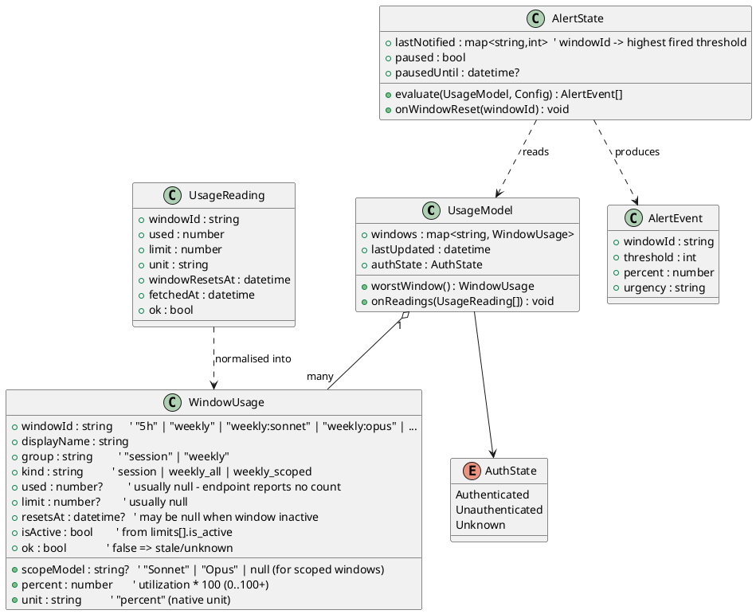

# Data Model

The core runtime data structures. These are conceptual (language-agnostic) — the [[Technology-Stack|implementation]] will likely render them as C++/Qt types. See how they connect in [[Architecture]].

## Class diagram

## Notes on key fields

- **`percent` comes straight from the endpoint's `utilization`** (which is already a 0–100 percent, used as-is — *not* multiplied by 100); the endpoint does **not** report raw used/limit counts, so `used`/`limit` are usually `null` and percentage is the native unit. See the field mapping in [[API-Reference-Usage-Endpoint]]. Percentage is the common currency for thresholds (see [[Usage-Limits-and-Windows]]).
- **`ok` / `AuthState`** let the [[System-Tray]] show *stale* and *unauthenticated* states distinctly from low usage.
- **`AlertState.lastNotified`** is the rising-edge memory described in [[Notifications-and-Alerts]]. It is **keyed per window id**, so per-model windows (`weekly:opus`, `weekly:sonnet`) alert and reset independently of each other and of the global windows.
- **`group` / `kind` / `scopeModel`** drive both display naming and config threshold resolution (per-window → per-group → global). See [[Usage-Limits-and-Windows#Window id & display naming]] and [[Configuration-Reference#Per-window and per-group thresholds]].
- Windows are **discovered from the response**, not a fixed enum — the model rebuilds its window map each poll, adding/removing entries as buckets appear or go inactive.
- **`pausedUntil`** backs the tray "Pause alerts" feature (see [[System-Tray]]).

## What gets persisted vs. in-memory

| Data | Lifetime |
|---|---|
| `UsageModel`, `WindowUsage` | in-memory (rebuilt each poll) |
| `AlertState.lastNotified` | in-memory; reset on window rollover. (Optionally persisted across restarts to avoid re-warning — TBD in [[Open-Questions]].) |
| Config | persisted (KConfig) — see [[Configuration-Reference]] |
| Account token | **not stored by us** — read read-only from Claude Code's `~/.claude/.credentials.json` at poll time. See [[Usage-Data-Provider#Token handling rules]] |
