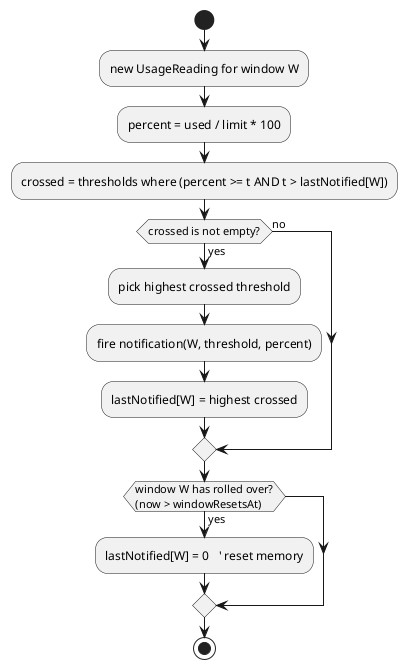

# Notifications and Alerts

This note covers **when** a popup fires and **how** it is presented. The logic lives in the **Alert Engine** + **Notification Service** (see [[Components]]).

## Core rule: notify on rising-edge crossings only

For each [[Usage-Limits-and-Windows|window]], the engine remembers the highest threshold it has already notified for in the current window period. It fires **once** when usage first crosses a threshold upward, not on every poll.

### Why rising-edge

Polling happens every interval; without edge-tracking we'd re-notify "you are at 72%" on every poll. Tracking `lastNotified` per window means:

- Crossing 70 → one popup.
- Staying between 70–80 → silence.
- Crossing 80 → one popup.
- Window resets → memory clears → can warn from 70 again next period.

### Falling usage

If usage drops (e.g. a partial reset), we **do not** lower `lastNotified` until a full window rollover. This avoids "ping-pong" re-notifications around a threshold boundary. (Configurable later via `reArmOnDecrease`.)

## Notification content

| Field | Example |
|---|---|
| Title | `Claude usage: 80% (5-hour)` |
| Body | `You've used 80% of your 5-hour limit. Resets at 14:30.` |
| Urgency | mapped from threshold (see below) |
| Icon | matches [[System-Tray]] severity |
| Actions | `Open usage`, `Pause alerts` |

## Threshold → urgency mapping

| Threshold | KDE urgency | Behaviour |
|---|---|---|
| 70% | Normal | standard popup |
| 80% | Normal | standard popup |
| 90% | High | stays longer / more prominent |
| 100% | Critical | persistent until dismissed |

These mappings are configurable — see [[Alert-Configuration]] and [[Configuration-Reference]].

## Per-window independence

The 5-hour and weekly windows have **separate** `lastNotified` memory, so hitting 70% on the 5-hour window does not suppress the 70% warning for the weekly window. Each fires its own notification, labelled with the window name.

## Delivery mechanism

The Notification Service is the only component that talks to **KNotifications**, which integrates with Plasma's notification system (Do Not Disturb, history, per-app settings). This keeps the popup mechanism swappable and testable — see [[Components]].
