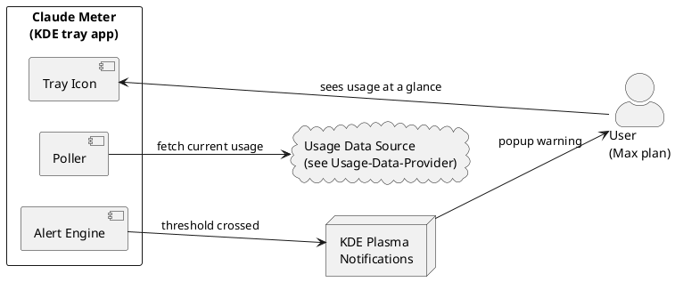

# Claude Meter — Overview

> [!info] Status
> **Planning / documentation phase.** No code has been written yet. These notes describe the intended architecture and behaviour of the application.

**Claude Meter** is a native KDE desktop application that lives in the system tray and warns you as you approach your Claude (Max plan) usage limits. It tracks both the **rolling 5-hour limit** and the **weekly limit**, and raises desktop notifications as you cross configurable thresholds (default: **70%, 80%, 90%, 100%**).

## Goals

- Show **current usage** of the linked Claude account at a glance (tray icon + tooltip).
- Notify the user **before** they hit a limit, so work can be paced.
- Track **multiple limit windows** independently (5-hour rolling window and weekly window).
- Be **configurable**: thresholds, which windows to watch, polling interval, notification style.
- Feel **native to KDE/Plasma**: KStatusNotifierItem tray entry, KNotifications popups, KConfig storage.

## Non-Goals (for now)

- Modifying or managing the Claude subscription itself.
- Controlling or throttling Claude usage automatically.
- Supporting desktop environments other than KDE Plasma (may work, not a target).

## How it works (one paragraph)

A background service polls a **Usage Data Provider** — by default the undocumented `api.anthropic.com/api/oauth/usage` endpoint, authenticated with the Bearer token Claude Code already stores locally (see [[Usage-Data-Provider]]) — for the account's current consumption against each limit window. The numbers are normalised into a simple **Usage Model** (used / limit / percentage / window reset time). An **Alert Engine** compares each window's percentage against the configured thresholds and, when a threshold is newly crossed, fires a **desktop notification**. A **system tray icon** continuously reflects the highest current usage so the state is always visible. All behaviour is driven by a **configuration file** the user can edit (or adjust through a small settings UI).

## Map of these notes

- [[Architecture]] — the big picture and component diagram.
- [[Components]] — what each part is responsible for.
- [[Usage-Data-Provider]] — where usage numbers come from (resolved: the OAuth usage endpoint).
- [[API-Reference-Usage-Endpoint]] — the live JSON schema of the usage/profile endpoints.
- [[Usage-Limits-and-Windows]] — the 5-hour vs weekly limit model.
- [[System-Tray]] — the tray icon, states, and menu.
- [[Notifications-and-Alerts]] — how and when popups fire.
- [[Alert-Configuration]] — configuring thresholds and behaviour.
- [[Configuration-Reference]] — the full config file schema.
- [[Data-Model]] — the core data structures.
- [[Workflows]] — sequence diagrams for the main flows.
- [[Technology-Stack]] — the KDE/Qt technologies involved.
- [[Open-Questions]] — unknowns to resolve before building.
- [[Roadmap]] — phased plan toward a working app.
- [[Glossary]] — terms used across these notes.

## High-level context diagram

