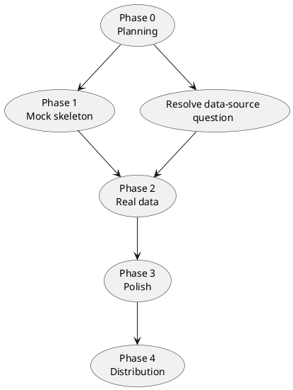

# Roadmap

A phased path from these planning notes to a working app. Ordering is chosen so the **data-source unknown** (see [[Open-Questions]]) does not block UI/alert work.

## Phase 0 — Planning (current)

- [x] Document architecture and concepts (these notes).
- [ ] Resolve top [[Open-Questions]] (data source, language).

## Phase 1 — Walking skeleton (mock data)

Goal: a tray app that warns correctly, using a **mock [[Usage-Data-Provider|provider]]** (`provider.kind = "mock"`).

- [ ] Tray icon with OK/Warning/Critical states ([[System-Tray]]).
- [ ] Poller + Usage Model + percentage derivation ([[Data-Model]]).
- [ ] Alert Engine with rising-edge logic and per-window memory ([[Notifications-and-Alerts]]).
- [ ] KNotifications popups at 70/80/90/100.
- [ ] Config loading with defaults ([[Configuration-Reference]]).

**Exit criteria:** feeding scripted usage values produces correct, non-spammy popups and a correct tray state.

## Phase 2 — Real data source

- [ ] Implement the **`oauth-http`** provider — see [[Usage-Data-Provider#Primary implementation: `oauth-http`]].
- [ ] Read Claude Code's Bearer token from `~/.claude/.credentials.json` (read-only); detect missing/expired.
- [x] Capture one real `/api/oauth/usage` response and finalise the JSON → [[Data-Model]] mapping. ✅ See [[API-Reference-Usage-Endpoint]]. (Remaining: confirm `percent` scale with a mid-range reading.)
- [ ] Stale/unauthenticated states wired to the tray.
- [ ] Backoff on failures ([[Workflows#5. Fetch failure (stale state)]]).

**Exit criteria:** real 5-hour and weekly usage drive the alerts.

## Phase 3 — Polish & configurability

- [ ] Quiet hours, pause-alerts presets, per-window thresholds.
- [ ] Urgency mapping configurable.
- [ ] Optional Settings UI ([[Components#Settings UI (optional, later)]]).
- [ ] Autostart entry.

## Phase 4 — Distribution

- [ ] Packaging (Flatpak / distro) — see [[Technology-Stack#Packaging & distribution]].
- [ ] Translations (KI18n).
- [ ] Icons / branding.

## Dependency graph

