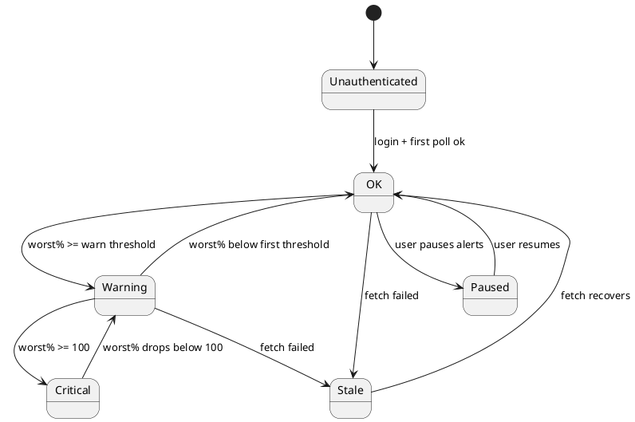
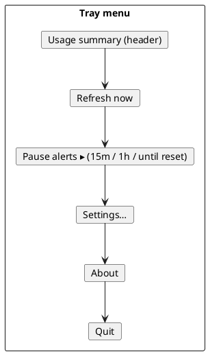

# System Tray

Claude Meter's primary, always-on presence is a Plasma system tray icon backed by a `KStatusNotifierItem`. It is owned by the **Tray Controller** (see [[Components]]).

## What the icon communicates

The icon reflects the **worst-case window** — the highest percentage among all tracked [[Usage-Limits-and-Windows|windows]] — so a glance tells you how close you are to *any* limit.

| State | When | Suggested look |
|---|---|---|
| OK | worst window < first threshold (e.g. <70%) | normal/neutral icon |
| Warning | worst window ≥ a warning threshold (70/80/90) | amber/orange overlay |
| Critical | worst window ≥ 100% | red overlay |
| Stale / Unknown | last fetch failed | greyed icon + badge |
| Unauthenticated | not logged in to Claude account | greyed icon + "!" |
| Paused | alerts paused by user | normal icon + pause badge |



> [!note]
> *Paused* affects only [[Notifications-and-Alerts|notifications]], not the icon's underlying usage state — the icon still shows real usage.

## Tooltip / breakdown

Hovering (or opening the menu) shows each window individually, since the icon only shows the worst case:

```
Claude Meter
  5-hour:           72%  (resets 14:30)
  Weekly (all):     43%  (resets Mon 00:00)
  Weekly · Sonnet:  31%  (resets Mon 00:00)
  Weekly · Opus:    88%  (resets Mon 00:00)   ⚠
  Updated: 12s ago
```

The list is built from the windows discovered in the latest response (see [[Usage-Limits-and-Windows]]), so model-scoped rows appear/disappear as those buckets activate. Inactive windows can be hidden via `windows.includeInactive` ([[Configuration-Reference]]).

## Context menu



- **Refresh now** — triggers the [[Components#Poller / Scheduler|Poller]] immediately.
- **Pause alerts** — suppresses notifications for a chosen duration (config: `pauseDurationsMinutes`).
- **Settings…** — opens the [[Alert-Configuration|settings]] (or reveals the config file until a UI exists).
- **Quit** — exits the app (autostart still relaunches at next login).

## Left-click behaviour

Single left-click could toggle a compact usage popup/overview; configurable later. Default activation opens the usage summary.
