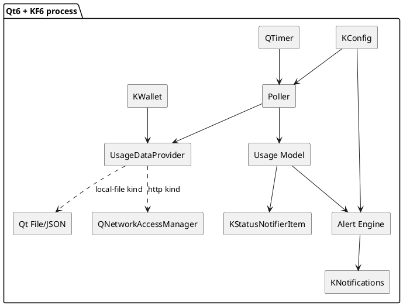

# Technology Stack

Proposed technologies for a **native KDE/Plasma** build of Claude Meter. Choices are provisional (see [[Open-Questions]]); the [[Architecture]] is deliberately decoupled so most of these can change.

## Core

| Concern | Proposed choice | Why |
|---|---|---|
| Language | **C++17/20** (alt: Python + PySide6) | Native KDE apps are C++/Qt; Python is faster to prototype |
| GUI / event loop | **Qt 6** | Foundation for KDE Frameworks 6 |
| KDE integration | **KDE Frameworks 6 (KF6)** | Native tray, notifications, config, secrets |
| Build system | **CMake** + **Extra CMake Modules (ECM)** | Standard for KDE projects |

## KDE Frameworks used

| Framework | Role in app | Maps to |
|---|---|---|
| **KStatusNotifierItem** (KStatusNotifier) | System tray icon + menu | [[System-Tray]] |
| **KNotifications** | Desktop popups, urgency, DnD integration | [[Notifications-and-Alerts]] |
| **KConfig** / KConfigXT | Load/save settings | [[Configuration-Reference]] |
| **KWallet** | *(Optional)* secure storage only if we ever cache anything sensitive. Note: the primary `oauth-http` provider **reads Claude Code's existing token** (`~/.claude/.credentials.json`) read-only and stores no token of its own. | [[Usage-Data-Provider#Authentication — piggyback on Claude Code]] |
| **KI18n** | Translations | (later) |
| **Kirigami / Qt Widgets** | Optional Settings UI | [[Components#Settings UI (optional, later)]] |

## Networking / data

| Concern | Option |
|---|---|
| HTTPS to `api.anthropic.com` (`oauth-http`) | Qt Network (`QNetworkAccessManager`) with `Authorization: Bearer` |
| Reading Claude Code's token + parsing the usage JSON | Qt JSON / standard file IO (read `~/.claude/.credentials.json`) |
| Scheduling | `QTimer` on the Qt event loop |

See provider options in [[Usage-Data-Provider]].

## Packaging & distribution

| Concern | Option |
|---|---|
| Autostart | freedesktop `.desktop` autostart entry |
| Distribution | Distro package, **Flatpak**, or AppImage |
| Tray availability | Requires a StatusNotifier host (Plasma provides one) |

## Component diagram (tech-mapped)

## Alternative: Python prototype

For a fast first version, **PySide6 + the `dbus`/`KNotification` route** (or even a plain `QSystemTrayIcon` + `notify-send`) could stand up the [[Roadmap|phase 1]] mock-provider app without the C++/CMake setup. Trade-off: less "native KDE", easier iteration. Decision tracked in [[Open-Questions]].
