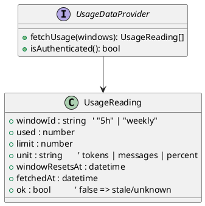
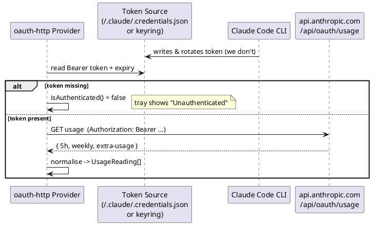
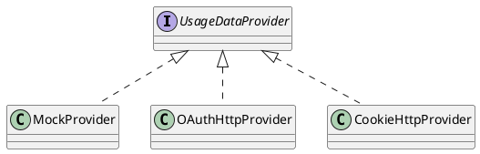

# Usage Data Provider

The boundary between Claude Meter and wherever the usage numbers come from. The rest of the app depends only on the **interface** (see [[Components]]), so implementations can be swapped without rework.

> [!success] Resolved: primary provider is the OAuth usage endpoint
> Existing tools (notably [`m13v/claude-meter`](https://github.com/m13v/claude-meter)) read Max-plan usage from an **undocumented OAuth endpoint Anthropic serves to its own Settings page**, authenticated with the **token Claude Code already stores locally**. We adopt this as the primary provider (`provider.kind = "oauth-http"`). See [[Open-Questions]] for what this resolves.

## The interface (conceptual)

A reading is normalised into the [[Data-Model|Usage Model]]. The `ok` flag lets the UI distinguish "fetch failed" from "0% used".

## Primary implementation: `oauth-http`

### Endpoints

| Endpoint | Returns |
|---|---|
| `GET https://api.anthropic.com/api/oauth/usage` | The rolling **5-hour** window, the **7-day / weekly** quota, and the **extra-usage** (overage) block — each with usage and reset time. |
| `GET https://api.anthropic.com/api/oauth/profile` | Account email + org UUID (for display / "linked account" identity). |

Both are called with an `Authorization: Bearer <token>` header.

> [!warning] Undocumented & unstable
> These endpoints are internal — Anthropic may change or remove them without notice. They are isolated behind this provider so a break degrades to a *stale* [[System-Tray|tray state]] (see [[Workflows#5. Fetch failure (stale state)]]) rather than crashing the app. Poll at a modest interval; this is your own account's data (the same numbers `claude.ai/settings/usage` shows).

### Authentication — piggyback on Claude Code

We do **not** implement our own login or token refresh. We read the Bearer token that the **Claude Code CLI** already manages, and let Claude Code rotate it.

- **Prerequisite:** Claude Code installed and logged in (`claude` run once).
- **Linux token location (verified on this machine):** `~/.claude/.credentials.json`, a JSON file (mode `600`) with a top-level **`claudeAiOauth`** object containing the access token, refresh token, and expiry. *(macOS equivalent: Keychain service `Claude Code-credentials`.)*
- **Alternative:** if a system keyring (libsecret / Secret Service) holds the credential instead, read it there.

### Token handling rules

- **Read-only.** Never write, refresh, or invalidate the token — Claude Code owns its lifecycle.
- **Never log** the token; never copy it into our own [[Configuration-Reference|config]].
- If the token is **expired/near expiry**, still attempt the call (Claude Code may have rotated it on disk since); on `401`, surface *unauthenticated* and prompt the user to re-run `claude`.
- Treat the file as sensitive: read at poll time, don't cache the raw value longer than needed.

## Fallback / alternative providers

| `kind` | How | Use |
|---|---|---|
| `mock` | Returns scripted values from config | [[Roadmap\|Phase 1]] — build the whole UI/alert pipeline before touching real endpoints |
| `cookie-http` | Same Settings-page endpoint, authenticated with a `claude.ai` **session cookie** (the approach used by ClaudeMeter via a browser extension) | Fallback if the OAuth endpoint isn't usable; needs a way to obtain the cookie |
| `oauth-http` | **Primary** — described above | Production |

## Failure handling

- Distinguish **fetch failure** (`ok = false`, keep last-known values, show *stale*) from genuine low usage.
- Apply **backoff** on repeated failures (see [[Components#Poller / Scheduler]]).
- On `401/403`, set [[Data-Model|AuthState]] = `Unauthenticated` and guide the user to re-login via Claude Code.

## Endpoint schema

The exact JSON shape of `/api/oauth/usage` and `/api/oauth/profile` was captured from a live response and is documented in **[[API-Reference-Usage-Endpoint]]**, including the field-to-window mapping. Key takeaways:

- Each window reports a **`utilization` float (0.0–1.0)** — no raw counts; percentage is the native unit.
- Windows available: `five_hour` → `5h`, `seven_day` → `weekly`, `seven_day_sonnet` → optional `weekly_sonnet`.
- ⚠️ The `limits[].percent` field appears to be a `0–1` fraction, not `0–100` — we use `utilization × 100`. See [[Open-Questions]].
