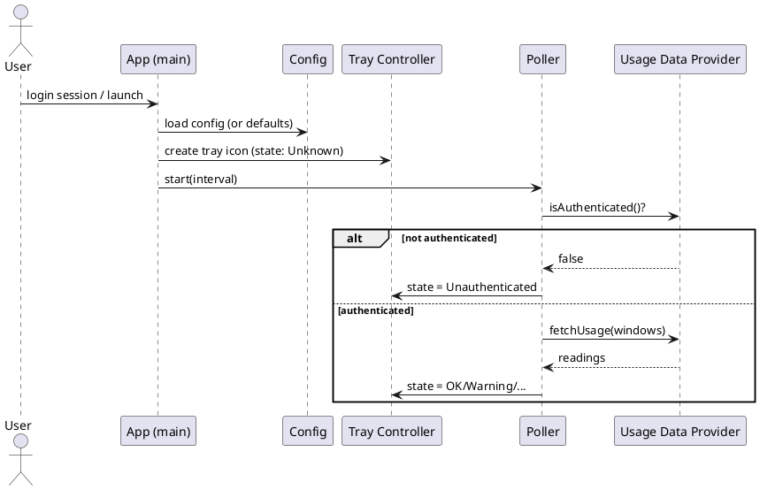
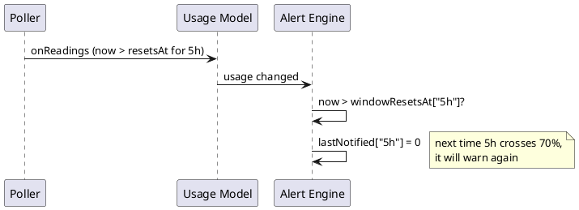
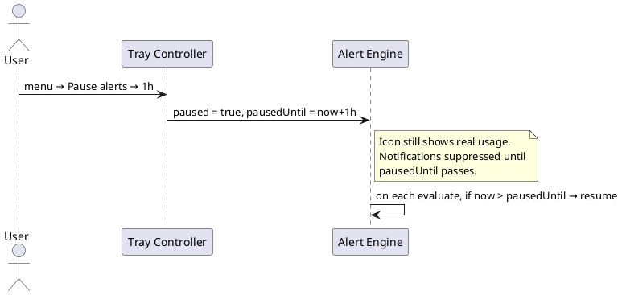
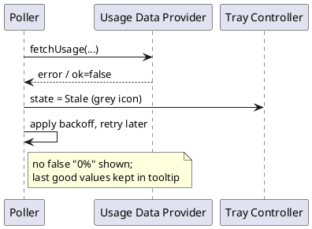

# Workflows

End-to-end sequences for the main scenarios, tying together the [[Components]].

## 1. Startup



## 2. Normal poll cycle (threshold crossed)

```plantuml
@startuml
skinparam shadowing false
participant "Poller" as Poll
participant "Usage Data Provider" as Prov
participant "Usage Model" as Model
participant "Alert Engine" as Alert
participant "Notification Service" as Notif
participant "Tray Controller" as Tray
node "KNotifications" as KN

Poll -> Prov : fetchUsage(["5h","weekly"])
Prov --> Poll : readings
Poll -> Model : onReadings(readings)
Model -> Model : compute percent, worstWindow
Model -> Alert : usage changed
Alert -> Alert : crossed = thresholds newly exceeded
opt crossed not empty
  Alert -> Notif : fire(window, threshold, percent, urgency)
  Notif -> KN : show popup
end
Model -> Tray : refresh icon + tooltip
@enduml
```

## 3. Window rollover (alert memory reset)



See the rule in [[Notifications-and-Alerts#Core rule: notify on rising-edge crossings only]].

## 4. User pauses alerts



## 5. Fetch failure (stale state)



Related: [[System-Tray]], [[Data-Model]].
